# telemetry

SQS event -> fetch S3 object -> extract payload -> Lambda -> write S3.

## Parameters

| Name | Sensitive | Default |
|---|---|---|
| `aws.region` | no | `eu-west-2` |
| `sqs.queue.url` | no | unset |
| `lambda.function.name` | no | unset |
| `s3.output.bucket` | no | unset |
| `s3.deadletter.bucket` | no | unset |
| `aws.access.key.id` | yes | unset |
| `aws.secret.access.key` | yes | unset |

## Components

| Name | Type | Purpose |
|---|---|---|
| `IN_GetSQS` | `GetSQS` | Long poll the queue for S3 event notifications. |
| `PRC_ParseS3Event` | `EvaluateJsonPath` | Read `s3.bucket` and `s3.key` into attributes. |
| `PRC_FetchS3Object` | `FetchS3Object` | Fetch the object. Keys are URL decoded inline. |
| `PRC_ExtractContent` | `EvaluateJsonPath` | Replace the content with the `$.payload` field. |
| `PRC_InvokeLambda` | `PutLambda` | Post the content. The response replaces it. |
| `OUT_Results` | `s3_sink` block | Write to the output bucket. |
| `ERR_DeadLetter` | `s3_sink` block | Write to the dead letter bucket. |
| `ERR_Unwritable` | `log_sink` block | Log flow files the dead letter bucket rejected. |
| `ERR_Fanin` | funnel | Collect every failure relationship. |

`OUT_Results` and `ERR_DeadLetter` are two instances of the same `s3_sink`
block. `ERR_DeadLetter` routes its own failures to `ERR_Unwritable` rather than
back to the funnel, which would be a cycle.

## Topology

```mermaid
flowchart LR
  classDef in fill:#CCE5FF,stroke:#495057,color:#212529
  classDef prc fill:#E2E3E5,stroke:#495057,color:#212529
  classDef out fill:#D4EDDA,stroke:#495057,color:#212529
  classDef err fill:#F8D7DA,stroke:#495057,color:#212529
  sqs["IN_GetSQS"]
  parse["PRC_ParseS3Event"]
  fetch["PRC_FetchS3Object"]
  extract["PRC_ExtractContent"]
  invoke["PRC_InvokeLambda"]
  fanin(( ))
  subgraph results["OUT_Results"]
    direction LR
    r_in[/"in"/]
    r_put["OUT_PutS3Object"]
    r_fail[/"failure"/]
    r_in --> r_put
    r_put -- "failure" --> r_fail
  end
  subgraph dead["ERR_DeadLetter"]
    direction LR
    d_in[/"in"/]
    d_put["OUT_PutS3Object"]
    d_fail[/"failure"/]
    d_in --> d_put
    d_put -- "failure" --> d_fail
  end
  subgraph unwritable["ERR_Unwritable"]
    direction LR
    u_in[/"in"/]
    u_log["ERR_LogAttribute"]
    u_in --> u_log
  end
  sqs -- "success" --> parse
  parse -- "matched" --> fetch
  fetch -- "success" --> extract
  extract -- "matched" --> invoke
  invoke -- "success" --> r_in
  parse -- "failure, unmatched" --> fanin
  fetch -- "failure" --> fanin
  extract -- "failure, unmatched" --> fanin
  invoke -- "failure" --> fanin
  r_fail --> fanin
  fanin --> d_in
  d_fail --> u_in
  class sqs in
  class parse prc
  class fetch prc
  class extract prc
  class invoke prc
  class r_put out
  class d_put out
  class u_log err
```

`flow.mmd` is the generated equivalent with real identifiers.
